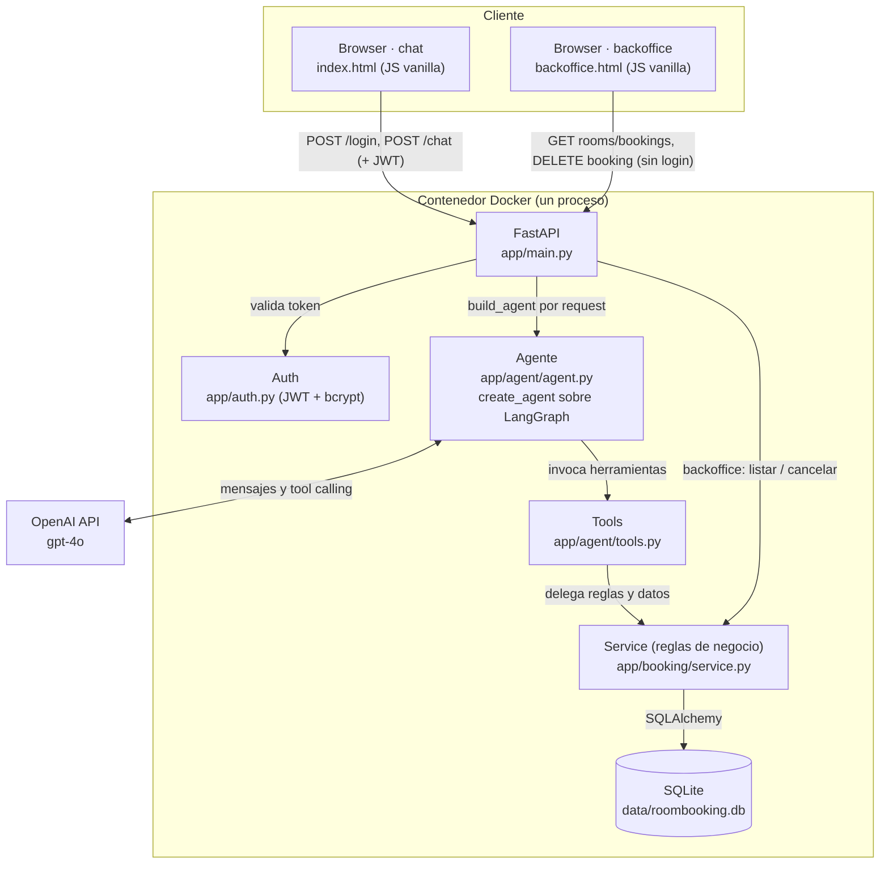
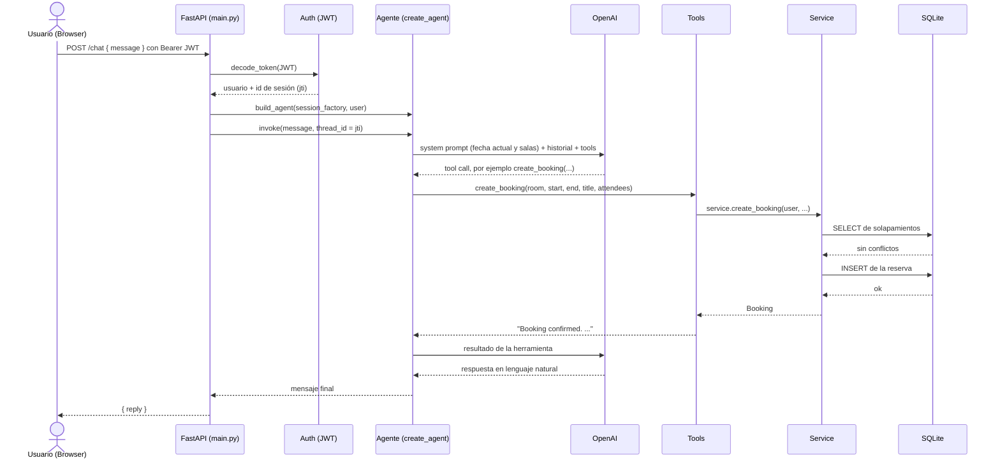

# Arquitectura de componentes

Este documento muestra los componentes de la solución y cómo interactúan desde que
llega el mensaje del usuario hasta que se devuelve la respuesta. Los diagramas están en
Mermaid, así que se renderizan directamente en GitHub y quedan versionados junto al
código.

## Vista de componentes

Todo vive en un único proceso Python dentro de un contenedor. La única dependencia
externa es la API de OpenAI. La interfaz web, la API HTTP y el agente los sirve el mismo
FastAPI, sin CORS ni build de frontend ni servicios extra que sincronizar.

## Flujo de un mensaje: de la pregunta a la respuesta

El loop entre el agente y el LLM puede repetirse varias veces en un mismo turno (el
modelo llama una herramienta, lee el resultado y decide el siguiente paso), con un techo
de 10 llamadas al modelo por mensaje para cortar cualquier bucle descontrolado.

## Rol de cada componente

- **Browser (`index.html`):** una sola página con JavaScript vanilla. Maneja el login,
  guarda el token JWT solo en memoria (no en `localStorage`) y renderiza el chat.
- **Backoffice (`backoffice.html`):** vista de operador en `/backoffice`, sin login (se
  entra por link). Calendario semanal por sala dibujado en JS vanilla (sin librerías), que
  consume endpoints públicos para listar y cancelar cualquier reserva. Sirve para verificar
  que los datos se guardan bien y corregirlos. Detalle y justificación en DECISIONS.md (D16).
- **FastAPI (`main.py`):** resuelve la identidad antes de tocar el agente, expone
  `/login` y `/chat`, y sirve la página estática. Un solo artefacto deployable.
- **Auth (`auth.py`):** valida credenciales con bcrypt y emite o verifica el JWT. El LLM
  nunca ve credenciales, porque el login es un paso HTTP fuera del chat.
- **Agente (`agent.py`):** arma el agente por request con `create_agent`. Inyecta en el
  system prompt el nombre del usuario, la fecha y hora actual y la lista de salas. Corre
  con dos middleware: uno resume el historial viejo para acotar el costo, otro limita las
  llamadas al modelo.
- **Tools (`tools.py`):** cinco herramientas (crear, listar salas libres, ver la agenda
  de una sala, listar las reservas propias, cancelar). Son wrappers finos: capturan la
  identidad del usuario por closure y abren una sesión de base por invocación.
- **Service (`service.py`):** la única fuente de verdad de las reglas (capacidad,
  duración, alineación a slots, no solapamiento, propiedad de la reserva).
- **SQLite:** un archivo en el volumen persistente. Las salas y los usuarios se siembran
  de forma idempotente en el arranque.

## Dos detalles de diseño que se ven en el flujo

- **Identidad segura:** el `user` no viaja como parámetro de ninguna herramienta. Queda
  capturado en la closure de `build_tools`, así que el LLM no tiene forma de reservar o
  cancelar en nombre de otro usuario.
- **Memoria de conversación:** el `thread_id` de LangGraph es el claim `jti` del JWT, un
  id único por sesión de login. Un login nuevo empieza una conversación nueva, sin estado
  extra en el servidor.
