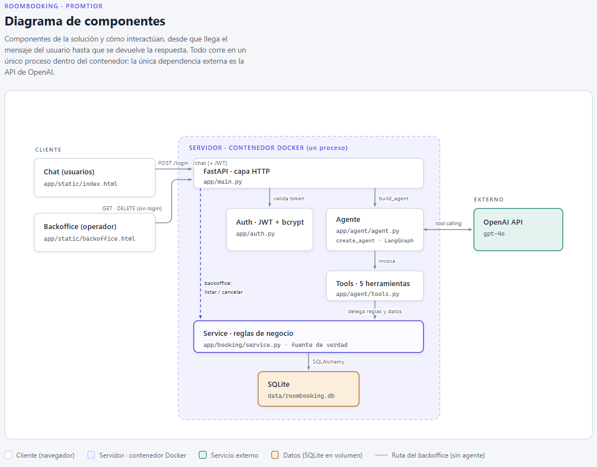

# Project Overview: RoomBooking

Asistente conversacional para reservar salas de reunión en la oficina de Cubo Itaú. El
usuario escribe en lenguaje natural (por ejemplo "reservá la sala B mañana a las 10 para
3 personas, reunión de equipo") y el sistema crea, consulta o cancela reservas según las
reglas del enunciado.

Stack: FastAPI, LangChain (`create_agent` sobre LangGraph), SQLite y la API de OpenAI
(`gpt-4o` por defecto, configurable por variable de entorno). Todo corre en un único
proceso que sirve la interfaz web, la API y el agente.

- **Demo:** https://promtior.manuanselmi.com (usuarios `User1` / `User2`, contraseña
  `TechnicalChallengePromtior`).
- **Repositorio:** https://github.com/manuanselmi/promtior-roombooking-challenge

## Cómo encaré el proyecto

Quería resolver el challenge de la forma más simple y barata que cumpliera con todo lo
pedido. De ahí salen casi todas las decisiones: no levanté una base de datos administrada,
no sumé servicios que no necesitaba, y cuando había dos caminos elegí el más liviano.

Antes de programar hice dos cosas: pensar la arquitectura a nivel general y decidir cómo
la iba a desplegar. Recién después empecé con las decisiones técnicas, y las tomé todas
antes de ponerme a escribir código.

Fue un ida y vuelta. La idea que quedó como columna vertebral es que el LLM se limita a
llamar herramientas, y las reglas de negocio las define y las hace cumplir el código que
está detrás de esas herramientas, no el modelo ni el prompt. El prompt puede enumerar las
reglas para ahorrar idas y vueltas, pero si lo borro entero, ninguna regla se puede
violar.

## Arquitectura

La solución está organizada en capas, cada una con una responsabilidad:

| Capa | Archivo | Responsabilidad |
|------|---------|-----------------|
| Modelo de datos | `app/booking/models.py` | Tablas User, Room, Booking |
| Reglas de negocio | `app/booking/service.py` | Única fuente de verdad de las reglas |
| Herramientas del LLM | `app/agent/tools.py` | Wrappers finos que traducen del LLM al service |
| Ensamblado del agente | `app/agent/agent.py` | Prompt, middleware y memoria de conversación |
| Autenticación | `app/auth.py` | Login con JWT y hashing con bcrypt |
| Capa HTTP | `app/main.py` | Endpoints de login, chat, backoffice y la página estática |



Una reserva se modela como un único rango contiguo `[start, end)` alineado a slots de 30
minutos. Combinar slots no contiguos es imposible por diseño, así que no tengo que validar
algo que no se puede escribir.

El agente se arma por request con `create_agent`, la API actual de LangChain 1.x que
compila un grafo de LangGraph. En cada mensaje decide si responde o si llama a una de las
cinco herramientas: crear una reserva, listar salas libres, ver la agenda de una sala,
listar las reservas propias y cancelar. Las herramientas no razonan: delegan en el
service, que valida todo y toca la base.

### Por qué este stack

**LangChain con `create_agent`.** El challenge sugiere LangChain de forma explícita, y
usarlo bien es parte de lo que evalúan. Elegí `create_agent`, la API actual de
LangChain 1.x sobre LangGraph, en vez de un loop manual con `bind_tools` o el
`AgentExecutor` legacy (que está deprecado): trae el loop ReAct, el tool-calling y el
checkpointing de memoria ya resueltos. De paso, LangChain era el único gap que tenía yo:
venía de orquestar agentes in-house, no con esta librería, así que me servía para
cubrirlo.

**OpenAI, `gpt-4o`.** Tengo crédito de OpenAI, que es la opción que el PDF recomienda si
uno tiene suscripción. Arranqué con `gpt-4o-mini` por barato, pero lo subí a `gpt-4o`
cuando vi que el mini no respetaba de forma confiable la instrucción de pedir los datos
faltantes: ante "reservá la sala B a las 15 para 2" reservaba un slot de 30 minutos en
silencio, aunque el prompt, el docstring de la tool y un ejemplo few-shot se lo prohibían.
`gpt-4o` obedece. Los requests son chicos, así que el costo por conversación es marginal,
y dejé el modelo configurable por variable de entorno para poder bajarlo o subirlo sin
tocar código.

**SQLite, no una base de datos real.** Acá es donde más pesaron la simplicidad y el
costo. El dominio es relacional y transaccional: la regla central, el no
solapamiento, es una range query, y la doble reserva se resuelve con una transacción. Un
motor relacional es justo lo que hace falta. Pero el alcance real es de 2 usuarios y 5
salas, así que no necesitaba un Postgres administrado (RDS), que suma otra pieza de infra
y unos 15 USD/mes. SQLite es un archivo, cero infra, cero costo, y con SQLAlchemy migrar a
Postgres el día que haga falta es cambiar la connection string. Descarté NoSQL (modelar el
no-solapamiento en DynamoDB o Mongo es más código para el mismo resultado, y sus ventajas
no aplican a este dominio) y descarté in-memory (se pierde al reiniciar).

**Un solo proceso: FastAPI sirve la UI, la API y el agente.** La interfaz es una página
estática propia (login más chat, en JavaScript vanilla) servida por el mismo FastAPI. Un
solo artefacto deployable, sin CORS, sin build de frontend, sin un servicio extra que
sincronizar. Lo preferí sobre Chainlit o Streamlit, que traen su propia UI pero esconden
el plumbing (login, token, flujo hacia el agente) que justamente quería dejar a la vista.

**`uv` para las dependencias.** Rápido, determinista, con lockfile, y me simplifica el
Dockerfile.

## Las reglas viven en el código

Todas las reglas del enunciado (slots de 30 minutos, máximo 3 horas, sin solapamientos,
capacidad por sala, cancelar solo lo propio) se validan en `service.py`, nunca en el
agente ni en el prompt. El LLM solo elige qué tool llamar, y si una llamada viola una
regla, recibe un error de vuelta y lo único que puede hacer es relatarlo. Las defensas
concretas:

- **Identidad por closure.** Las tools se construyen por request dentro de una función que
  ya recibió al usuario autenticado del JWT, y lo capturan en su clausura. El `user` no es
  un parámetro que el modelo pueda completar, así que "reservá a nombre de User2" no tiene
  forma de ejecutarse.
- **Errores como datos.** Las violaciones de regla vuelven como strings (`BOOKING
  REJECTED: ...`), nunca como excepciones: así el agente solo puede relatarlas y ofrecer
  una alternativa, sin cortar el loop.
- **Fecha y hora inyectadas** en el system prompt por request, porque el LLM no tiene
  reloj.
- **Techos de costo.** Como el deploy es público y consume mi crédito, puse dos límites:
  un middleware que resume los turnos viejos pasados los ~3k tokens (cada turno reenvía el
  historial completo) y otro que corta en 10 llamadas al modelo por mensaje. Y
  `temperature=0`, que para tool-calling estructurado es lo que corresponde.

Donde el enunciado dejaba libertad, definí defaults simples y los dejé documentados:
capacidades de A:2 a E:10 (una escalera fácil de recordar y testear), sin restricción de
horario, un único timezone (America/Montevideo, que es donde está Cubo Itaú), y el bot
responde en el idioma del usuario.

## Los desafíos técnicos

**La identidad del usuario.** Tenía que garantizar que las operaciones se hicieran siempre
sobre el usuario correcto, sin que el chat pudiera suplantarlo (un "cancelá la reserva 3"
ajena, un "reservá a nombre de User2"). Lo resolví con la identidad por closure de arriba,
más una segunda verificación en el service antes de cancelar. Y el login va fuera del chat
(JWT + bcrypt), así el LLM nunca ve credenciales: un login conversacional las haría viajar
por el historial hacia la API de OpenAI y los logs.

**El LLM no tiene reloj.** Sin la fecha actual, "mañana a las 10" es irresoluble y el bot
reservaría en el pasado. La inyecto en el system prompt en cada request.

**La doble reserva.** FastAPI atiende los endpoints sync desde un threadpool, así que dos
requests simultáneos podían intercalarse entre el chequeo de solapamiento y el INSERT, y
crear dos reservas solapadas sin que ninguno viera el conflicto. Lo cerré con un lock de
proceso alrededor de la sección crítica, verificado con un test donde 10 threads
sincronizados por una barrera intentan la misma reserva y exactamente uno gana. Alcanza
porque el deploy es un único proceso; con múltiples réplicas la garantía tendría que bajar
a la base (un exclusion constraint de Postgres), y así lo dejé anotado.

Ya con el sistema andando, probando aparecieron dos bugs de robustez que cerré. Las tool
calls en paralelo de un mismo turno compartían una sesión de SQLAlchemy, que no es
thread-safe (el `ToolNode` de LangChain las corre en threads separados): pasé a un session
factory, una sesión por invocación de tool. Y un datetime con timezone que a veces mandaba
el modelo (una `Z` o un offset) rompía la comparación con el reloj naive del sistema; en
vez de convertirlo en silencio (una `10:00Z` se volvería 07:00 y nadie lo notaría), lo
rechazo con un mensaje que el agente corrige.

## El backoffice

Además del chat sumé un backoffice en `/backoffice`: una vista de operador con la semana
por sala, para verificar de un vistazo que las reservas se guardan bien y poder cancelar
cualquiera sin pasar por el chat (el chat está atado a un usuario y solo cancela lo
propio). Reusa el mismo FastAPI y el mismo service, con dos helpers que saltean a propósito
la regla de propiedad, así el "quién puede qué" queda en un solo lugar. El frontend es
vanilla, sin librería de calendario ni build, coherente con el resto de la UI.

Es deliberadamente sin login: se entra por link. El riesgo asumido es que, al estar en una
URL pública, cualquiera que la descubra puede cancelar reservas. Es aceptable para una demo
evaluable; en un entorno real lo protegería con login o una red interna.

## Deploy

El deploy es donde más miré el costo. Quería que funcionara bien la primera vez que
entrara el evaluador, sin cold starts, y lo más barato posible.

Elegí un único contenedor Docker en una instancia de **AWS Lightsail**: precio fijo bajo
(unos 5 USD/mes), con IP y disco persistente incluidos. Ese disco persistente es lo que
hace viable el SQLite (el archivo sobrevive a los reinicios), así que la decisión de no
usar una base administrada y esta se sostienen mutuamente: sin base real, no necesito más
que una VM barata con disco. Adelante puse **Caddy** como reverse proxy, que termina TLS y
saca el certificado de Let's Encrypt solo, para servir por HTTPS en un subdominio propio. El
mismo `Dockerfile` corre local y en la nube, con un par de detalles de prolijidad
(dependencias en una capa cacheada aparte del código, usuario no-root, un healthcheck).

Lo que descarté, mirando siempre el costo y la cantidad de piezas:

- **Lambda + API Gateway:** cold starts en un chat, packaging pesado de LangChain, y un
  filesystem efímero que me empujaría a DynamoDB o RDS. Cuatro o cinco piezas de infra para
  2 usuarios.
- **Fargate / App Runner:** storage efímero (mata el SQLite) y, con el balanceador que
  necesita para una IP estable, sale del orden de 25 USD/mes contra los ~5 fijos de
  Lightsail.
- **RDS (Postgres administrado):** unos 15 USD/mes y otra pieza que mantener, para un
  dominio que SQLite resuelve de sobra.

La lógica de fondo es que la elección de cómputo depende de dónde vive el estado. Con el
estado en un archivo local, el fit natural es una VM barata con disco. Si esto tuviera que
escalar, primero sacaría el estado del disco (Postgres con un exclusion constraint para el
solapamiento) y recién ahí Fargate con réplicas sería lo correcto.

## Testing

82 tests que cubren cada capa determinista sin gastar una llamada al LLM: las reglas de
negocio del service (con base en memoria y un `now` inyectado), las tools directo (los
strings de rechazo y el binding de identidad), los contratos HTTP (login, 401, sesión por
token) y los endpoints del backoffice. El LLM es no determinista, así que no lo testeo con
asserts; lo probé a mano y con la demo del notebook.

## Cómo correr el proyecto

Local con uv:

```bash
uv sync
echo "OPENAI_API_KEY=sk-..." > .env
uv run uvicorn app.main:app --reload
```

Con Docker:

```bash
docker build -t roombooking .
docker run -d -p 8000:8000 -v roombooking-data:/app/data \
  -e OPENAI_API_KEY=sk-... roombooking
```

En ambos casos la app queda en `http://localhost:8000`, con `User1` y `User2` ya
sembrados. La explicación técnica con ejemplos de código ejecutables está en
[`notebook.ipynb`](notebook.ipynb).

## Mejoras futuras

Lo que dejé afuera a conciencia para no pasarme del alcance: streaming de las respuestas
(SSE), migrar a Postgres con exclusion constraint el día que haya varias réplicas, proteger
el backoffice con login o red interna, horario de oficina configurable, y evals
automatizados del agente.
